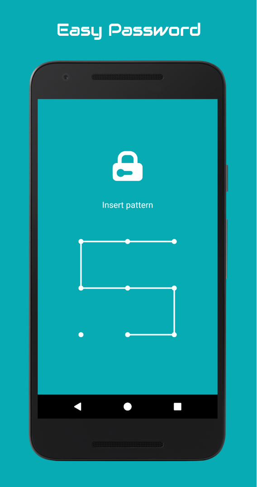
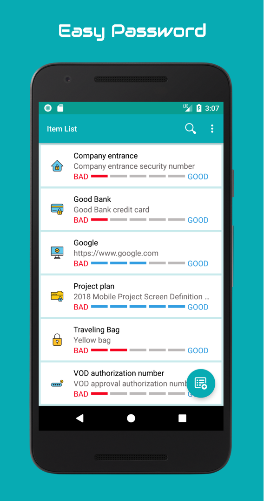
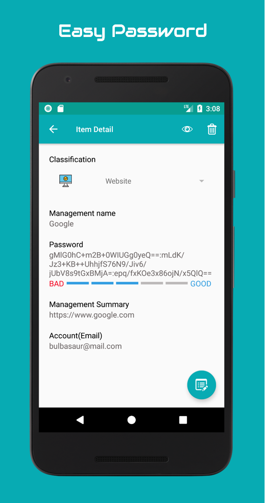
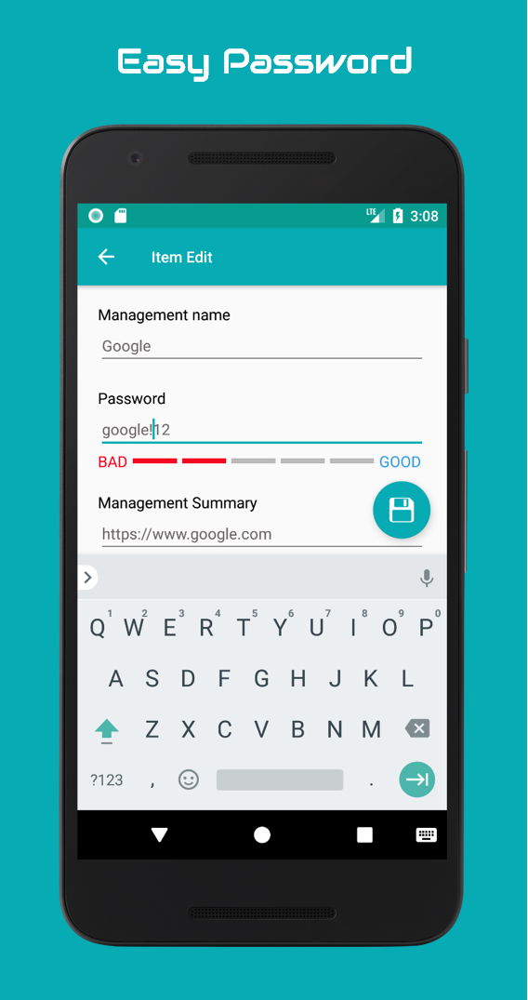
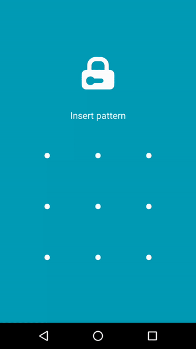
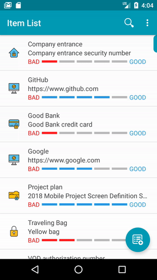

# Easy Password
[](https://github.com/unicodeveloper/awesome-opensource-apps)
[](https://github.com/KotlinBy/awesome-kotlin)
[![License][licensesvg]][LICENSE.md]


Easy Password is password management application.   
This application uses pattern locks to manage information that requires security.   

# Precautions
Can be exposed to brute-force attacks if Realm db files are hijacked.

# Support Features
```
01. Application lock with pattern
02. Password strength check
03. Encryption and decryption with AES of passwords to be managed using lock pattern
04. Backup and recovery of management list using Google Drive
```

# Screen Shots
&nbsp;
   
&nbsp;
   
&nbsp;


# How to build
```
Step1. Fork or download 'aaf-easypassword' project.
Step2. Import 'aaf-easypassword' project into android studio.
Step3. Use below link download svg images from Flaticon.
Step4. Import 6 svg files for your project from your Android studio.
       Project rightclick > New > Vector Asset... You can import from the menu and the resource names are:
       001-password.svg    -> icon_password.xml
       003-folder.svg      -> icon_folder.xml
       005-credit-card.svg -> icon_credit_card.xml
       009-lock.svg        -> icon_lock.xml
       012-television.svg  -> icon_web.xml
       015-home.svg        -> icon_home.xml
Step5. Generate your salt string from GenerateSaltString.kt android testcase.
       'GenerateSaltString.kt' file rightclick > Run(Android instrumented test) > GenerateSaltString 
       Apply filter name 'GenerateSaltString-testGenerateSaltString' to Logcat and copy salt string from log.
Step6. Define salt string into 'AesUtils.kt' file       
Step7. Register your package name and SHA-1 signature certificate fingerprint for Google Drive use.(https://console.developers.google.com/)
Step8. Build 'aaf-easypassword' project with android studio.
```
[Download security-40 svg images from Flaticon](https://www.flaticon.com/packs/security-40)

# License
[LICENSE][LICENSE.md]

[licensesvg]: https://img.shields.io/badge/License-Apache--2.0-brightgreen.svg
[LICENSE.md]: https://github.com/hanjoongcho/aaf-easypassword/blob/master/LICENSE.md
